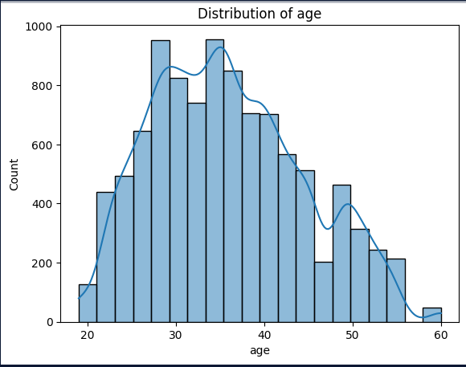
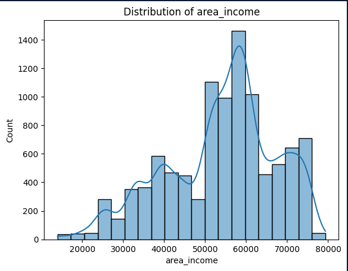
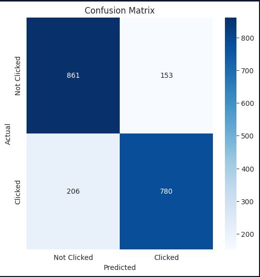
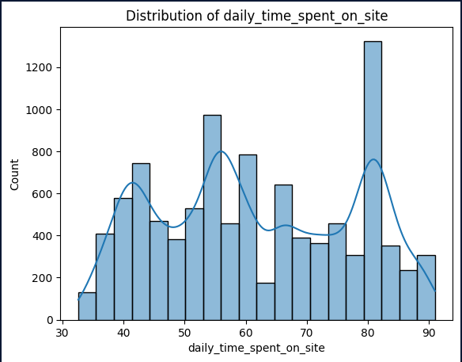
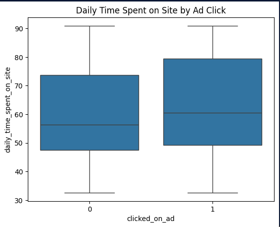

### Prediction of click through rate of an AD

### Problem Description
In the digital marketing era, businesses heavily rely on online advertisements to engage users and convert them into customers. However, understanding which users are likely to click on an advertisement remains a challenge. Predicting click-through rates (CTR) is essential for optimizing advertising strategies, improving user targeting, and maximizing revenue.

The primary problem addressed by this project is:

    How can we predict if a user will click on an advertisement based on their behavioral and demographic data?

Key Challenges:

User Behavior Analysis:

1.Identifying the correlation between features such as daily internet usage, time spent on the site, and ad interactions.

Demographic Insights:

1.Understanding how user demographics (e.g., age, income, location, and gender) influence ad clicks.

Real-Time Predictions:

1.Deploying a model capable of making accurate predictions to aid in real-time decision-making for ad placement.

Scalability:

1.Creating a solution that can scale effectively to handle large datasets and serve predictions through an API.

This project addresses these challenges by building a machine learning model to predict click-through rates and deploying it as an easily accessible REST API, enabling practical integration into marketing workflows.

### EDA

 
Distribution of Age

 
Distributio of Area income

 
Confusion Matrix

 
Daily time spent on site by Ad Click

 
Daily time spent on site

 
Daily time spent on site by Ad Click

### Instructions to Run the Project

#### Local Setup
Clone the Repository: 

    git clone https://github.com/kibetamos/ML-zoomcamp-Homework.git
    cd ML_project

Set Up the Python Environment:

#### we are using requirements.txt
Create and activate virtual environments:
    python -m venv venv

    source venv/bin/activate  # On Windows use: venv\Scripts\activate

Install dependencies:

    pip install -r requirements.txt

### Docker
We have a Docker file provided and we can have it up by running:
As application is fully containerized, it can be deployed on any virtual machine (AWS, Azure, GCP).

    docker-compose.yaml
    Dockerfile
app.py - Flask web app which loads best model and processes received data to predict churn. By default it serves on port 5555. You can change it in settings.py and Dockerfile.

If you want to develop the project, pay attention to settings.py, it contains key parameters.

